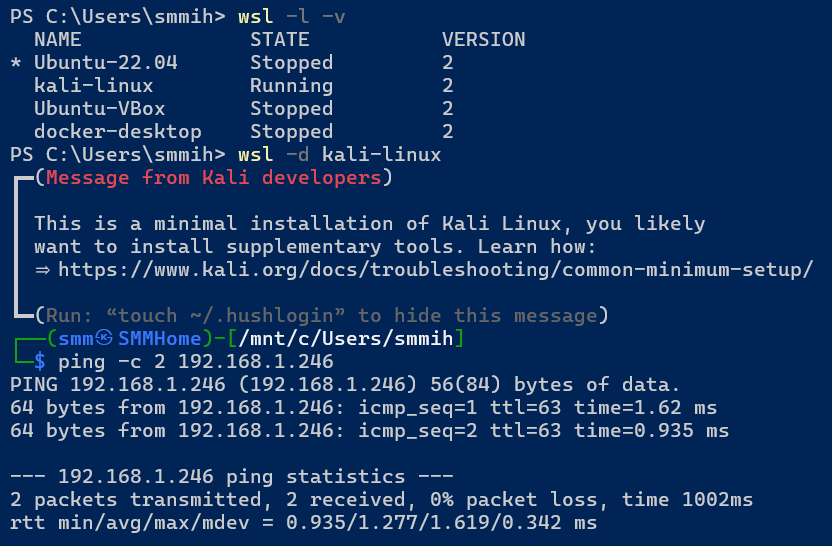
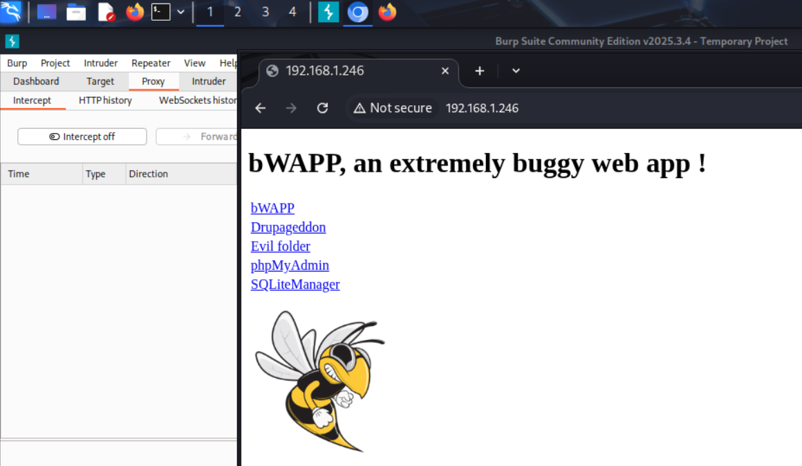
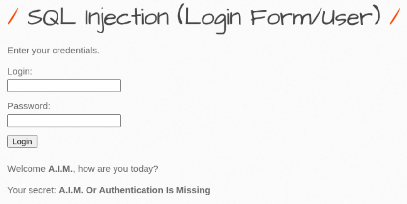
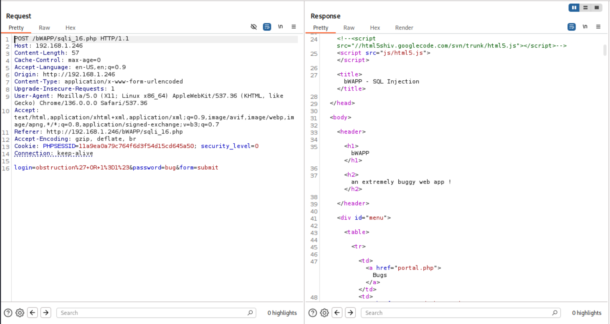
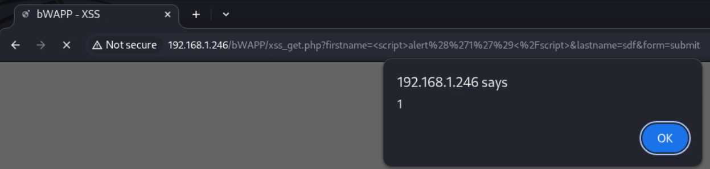
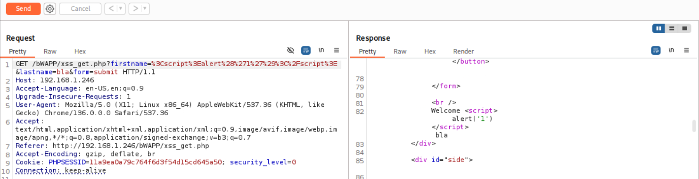
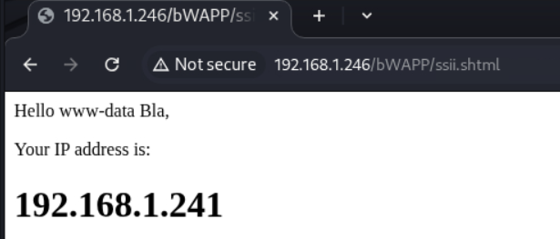
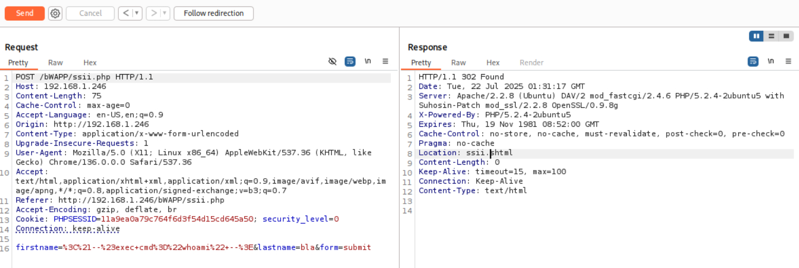

# Домашнее задание к занятию «Белый хакинг: тестирование на проникновение»- Михалёв Сергей.

### Цель задания

Белый хакер должен знать, как правильно проводить тестирование на проникновение в современных веб-технологиях. И он точно сможет анализировать уязвимости, чтобы обезопасить свою технику.

В результате выполнения задания вы сможете обнаружить, эксплуатировать и тестировать веб-технологии на основе методологии OWASP.

------

### Чеклист готовности к домашнему заданию

1. Доступ к интернету.
2. Установленная Windows OS или Linux OS.

------

### Инструкция к заданию

1. Загрузите операционную систему с образом bWAPP для изучения OWASP Top 10.
2. Следуя инструкции из вебинара, установите и подключитесь к виртуальной машине.
3. Выполните задание.

------

### Инструменты и дополнительные материалы, которые пригодятся для выполнения задания

1. [bWAPP](http://www.itsecgames.com/download.htm)
2. [Debian](https://www.kali.org/get-kali/#kali-virtual-machines)
3. [Дополнительная информация о bWAPP на англиском языке](http://itsecgames.blogspot.com)

------

### Задание 1: анализ уязвимостей OWASP

1. Для выполнения работы запустите образы операционных систем на базе ОС [Debian](https://www.kali.org/get-kali/#kali-virtual-machines) и [bWAPP](http://www.itsecgames.com/download.htm).
2. Настройте сетевой доступ: Kali Linux — `192.168.0.1`, Bee-Box — `192.168.0.2`.
3. Запустите Burp Suite. Включите проксирование.
4. Получите доступ к сайту Bee-Box, открыв браузер в системе Kali Linux по адресу `192.168.0.2`. Логин и пароль для доступа: `bee/bug`. 
5. Выберите атаки типа SQL injection.
6. Проведите SQL injection типа `obstruction' OR 1=1#` и получите полный ответ от сервиса.
7. Проанализируете перехваченные Burp Suite пакеты и посмотрите, что передаёт клиент серверу и что отвечает сервер. 
8. Приведите снимок экрана в отчёт и выводы по анализу.  
9. Выберите атаки типа Cross-Site Scripting (XSS).
10. Проведите атаку путём injection HTML-кода типа `alert(‘1’);`.
11. Проанализируете перехваченные Burp Suite пакеты и посмотрите, что передаёт клиент серверу и что отвечает сервер. 
12. Приведите снимок экрана в отчёт и выводы по анализу.  
13. Выберите атаки типа Server-Side Includes (SSI).
14. Проведите атаку путём injection `<!--#exec cmd="whoami" -->`.
15. Проанализируете перехваченные Burp Suite пакеты и посмотрите, что передаёт клиент серверу и что отвечает сервер. 
16. Приведите снимок экрана в отчёт и выводы по анализу.  


## Решение

1. Использовал Kali-Linux на WSL Windows. Поднял Bee-Box в VirtualBox как было показано в задании. Организовал сетевую связаность между машинами.

2. Запустил Burp Suite. Включил проксирование.
4. Получите доступ к сайту Bee-Box, открыв браузер в системе Kali Linux по адресу `192.168.1.246`. Логин и пароль для доступа: `bee/bug`. 

5. Выбрал атаку типа SQL injection.
6. Проведите SQL injection типа `obstruction' OR 1=1#` и получите полный ответ от сервиса.

7. Проанализируете перехваченные Burp Suite пакеты и посмотрите, что передаёт клиент серверу и что отвечает сервер. 
8. Приведите снимок экрана в отчёт и выводы по анализу. 
 
```
<p>Welcome <b>A.I.M.</b>, how are you today?</p>
<p>Your secret: <b>A.I.M. Or Authentication Is Missing</b></p>
```
Пароль был проигнорирован, так как `OR 1=1` сделал проверку условия всегда-истинной.

9. Выберите атаки типа Cross-Site Scripting (XSS).
10. Проведите атаку путём injection HTML-кода типа `alert(‘1’);`.

11. Проанализируете перехваченные Burp Suite пакеты и посмотрите, что передаёт клиент серверу и что отвечает сервер. 
12. Приведите снимок экрана в отчёт и выводы по анализу.  

Уязвимость проявилась из-за отсутствия валидации и экранирования пользовательского ввода.

13. Выберите атаки типа Server-Side Includes (SSI).
14. Проведите атаку путём injection `<!--#exec cmd="whoami" -->`.

15. Проанализируете перехваченные Burp Suite пакеты и посмотрите, что передаёт клиент серверу и что отвечает сервер. 
16. Приведите снимок экрана в отчёт и выводы по анализу.  

Репитер показал что запрос перенаправлен:
```
HTTP/1.1 302 Found
Location: ssii.shtml
```
Но на первом скриншоте видно что запрос `whoami` выполнен, и мы получили имя пользователя: `www-data`.
